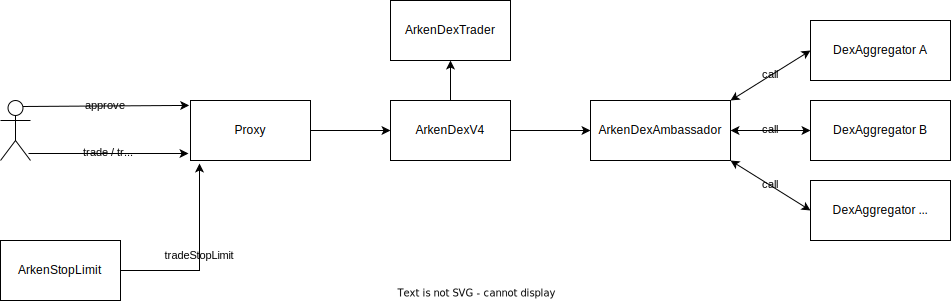
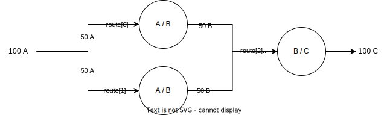

# ArkenDexV4

## Overview

ArkenDexV4 is a new version of ArkenDex Protocol. The main functionality of ArkenDex remains the same, but minor changes were made. These include implementation of tradeOutside, library linking of a contract between ArkenDexV4 and ArkenDexTrader, and wrapping ArkenDexV4 within ArkenERC1967Proxy for upgradeability. Try out our [app](https://swap.arken.finance/), learn more about [Arken](https://docs.arken.finance/arken-finance/resources/faq#what-is-arken-finance), and check out previous audit reports from [Inspex](https://app.inspex.co/library/arken-finance#?scope=arken-finance-arkendexv3-arkenapprove) and [CertiK](https://skynet.certik.com/projects/arkenfinance) for added context.

### The protocol main contracts

* ArkenDexV4: The main entry point for all trading actions, including Trade, TradeOutside, and TradeStopLimit. These are three main functions a user will interact with. These functions are described in more detail in the next section.
* ArkenDexTrader: The library that provides utilities for ArkenDexV4. This contract deployed once as a library then linked to ArkenDexV4.
* ArkenDexAmbassador: This contract is responsible for interacting with other DEX aggregators. The tradeOutside function within ArkenDexV4 will call to this contract with a restricted amount of token.



### Three main functions of ArkenDexV4

*trade*
```solidity
function trade(
        ArkenDexTrader.TradeDescription calldata desc
) external payable
```
Performs trade with multiple DEXs at the best rate by our protocol.

* In practice, ArkenDex charges a 0.1% fee for trades, the fee can be deducted from either srcToken or dscToken which is determined by isSourceFee. 
* msg.sender should have already given ArkenERC1967Proxy an allowance of at least amountIn on srcToken.
* TradeDescription (struct)
  * srcToken (address): A source token.
  * dstToken (address): A destination token.
  * amountIn (uint256): The amount of srcToken sent to ArkenDex.
  * amountOutMin (uint256): The minimum amount of dstToken that must be received for the transaction not to revert.
  * to (address): Recipient of the dstToken.
  * routes ([]TradeRoute): An array of TradeRoute. Each route will be iterated sequentially.
  * isRouterSource (bool): A flag indicating whether srcToken will be sent to ArkenDex or directly to another DEX router.
  * isSourceFee (bool): A flag indicating whether a fee will be deducted from srcToken or dscToken.
* TradeRoute (struct): It can be divided into two categories, including general information, and DEX-specific information. 
  * General Information:
    * routerAddress (address): A router.
    * lpAddress (address): A liquidity pool.
    * fromToken (address): A token.
    * toToken (address): A token.
    * from (address): An address indicating whether fromToken should transfer from ArkenDex or directly from msg.sender to the liquidity pool. 
      * address(0) denotes transfer from ArkenDex.
      * address(1) denotes transfer from msg.sender.
    * to (address): The receiver of toToken either ArkenDex or TradeDescription.to.
      * address(0) denotes receiver is ArkenDex.
      * address(1) denotes receiver is TradeDescription.to.
    * part (uint32): The fraction, it is represented as a percentage, with a value between 0 and 100000000. This value indicates the amount of fromToken that should be sent. amountIn = fromToken.balanceOf(this) * part / 10**8) 
    * dexInterface (enum RouterInterface)
  * DEX-specific information:
    * direction (uint8): DODO
    * fromTokenIndex (int16): Vyper
    * toTokenIndex (int16): Vyper
    * amountAfterFee (uint16): UniswapV2 and Bakery
* Example:
  * Trade Parameters
    * srcToken: 0x000000000000000000000000000000000000000A
    * dstToken: 0x000000000000000000000000000000000000000C
    * amountIn: 100
    * to: 0x000000000000000000000000000000000000FFFF
    * routes: (JSON format)
        ```json
        {
            "dexInterface": 0,
            "part": 50,
            "fromToken": "0x000000000000000000000000000000000000000A",
            "toToken": "0x000000000000000000000000000000000000000B",
            "from": "0x0000000000000000000000000000000000000000",
            "to": "0x0000000000000000000000000000000000000000",
            "lpAddress": "0x000000000000000000000000000000000000EEE1",
        },
        {
            "dexInterface": 1,
            "part": 100,
            "fromToken": "0x000000000000000000000000000000000000000A",
            "toToken": "0x000000000000000000000000000000000000000B",
            "from": "0x0000000000000000000000000000000000000000",
            "to": "0x0000000000000000000000000000000000000000",
            "lpAddress": "0x000000000000000000000000000000000000EEE2",
        },
        {
            "dexInterface": 2,
            "part": 100,
            "fromToken": "0x000000000000000000000000000000000000000B",
            "toToken": "0x000000000000000000000000000000000000000C",
            "from": "0x0000000000000000000000000000000000000000", # Arken is a sender.
            "to": "0x0000000000000000000000000000000000000001", # msg.sender is a receiver.
            "lpAddress": "0x000000000000000000000000000000000000EEE3",
        }
        ```
  * Assume that the exchange rate of lpAddresses 0xEEE1, 0xEEE2 and 0xEEE3 is 1:1.
    

*tradeOutside*
```solidity
function tradeOutside(
        ArkenDexTrader.TradeDescriptionOutside calldata desc,
        bytes calldata interactionDataOutside,
        uint256 valueOutside,
        address targetOutside
) external payable
```
Performs trade with other DEX aggregators. Will receive calldata and target and then call ArkenDexAmbassador for further trading.

*tradeStopLimit*
```solidity
function tradeStopLimit(
        ArkenDexTrader.TradeDescription calldata desc,
        uint256 stopLimitFee,
        uint256 minimumStopLimitFee
) external payable
```
The TradeStopLimit function performs as a trade function, but with the differences in how the fees are handled and events are emitted. This is designed for our stop-loss and limit order protocol.